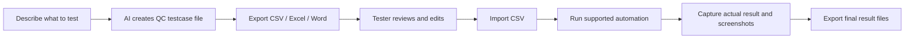

# Passmark TestOps

<p>
  
  
  
  
</p>

**Local AI testcase generation and lightweight automation runner for QC teams.**

Passmark TestOps helps testers turn a natural-language testing request into a QC-ready testcase file, review it outside the app, import it back, run supported automation, capture screenshots, and export the final result bundle.

<table>
  <tr>
    <td><strong>Primary flow</strong></td>
    <td>AI testcase file first, automation second.</td>
  </tr>
  <tr>
    <td><strong>Best for</strong></td>
    <td>QC teams that want editable testcase artifacts before running automated checks.</td>
  </tr>
  <tr>
    <td><strong>Runtime</strong></td>
    <td>Docker Compose with PostgreSQL, Ollama, and the web app.</td>
  </tr>
</table>

## Choose Language

<p>
  <a href="./README.vi.md"><strong>Đọc bản tiếng Việt</strong></a>
  &nbsp;|&nbsp;
  <a href="./README.en.md"><strong>Read the English guide</strong></a>
</p>

## Product Flow



## Interface Preview

```text
Passmark TestOps
├─ Project: Website QA
│  ├─ Homepage SEO review
│  ├─ Elder-user UI check
│  └─ Checkout regression
│
└─ Current item
   What do you want to test?
   [ https://example.com/                                ]
   [ Describe risks, modules, pages, roles, data...      ]
   [ Generate testcase file ]

   Run history
   - testcase file generated: 40 cases
   - auto test result: 38/40 passed, screenshots attached
```

> Markdown platforms usually block JavaScript-powered language switching inside README files, so this repository uses reliable language links instead.
