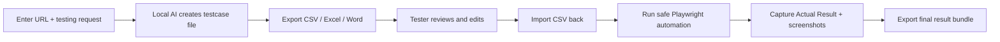

# Passmark TestOps

<p>
  
  
  
  
</p>

**Local AI QC testcase generator and lightweight automation runner.**

Type a URL plus a business testing request, then get a QC-ready testcase file in CSV, Excel-compatible, and Word-compatible formats. Review it outside the app, import the CSV back, run safe Playwright automation, and export the final result bundle with actual results and screenshots.

## Pick A Language

<p>
  <a href="./README.en.md"><strong>English guide</strong></a>
  &nbsp;|&nbsp;
  <a href="./README.vi.md"><strong>Hướng dẫn tiếng Việt</strong></a>
</p>

## 30-Second Pitch

- **Before:** a QC/Tester spends 1-2 hours writing login, registration, checkout, SEO, or UI regression testcases by hand.
- **After:** enter a URL and a short request, then export a structured testcase file with steps, expected results, priorities, and automation hints.
- **Local-first:** runs with Docker Compose, PostgreSQL, Ollama, and Playwright. No paid AI API is required by default.

## Quick Start

```powershell
git clone https://github.com/Mavis-TETRA/passmark-testops.git
cd passmark-testops
copy .env.example .env
docker compose up --build
```

Open:

```text
http://localhost:5000
```

Try this prompt:

```text
Create QC testcases for a login form, including valid login, invalid password,
empty required fields, locked account, session timeout, accessibility labels,
and screenshot evidence for failures.
```

## Demo Artifacts

- Sample import/output CSV: [docs/samples/login-form-testcases.csv](./docs/samples/login-form-testcases.csv)
- The app exports the same testcase data as CSV, Excel-compatible `.xls`, and Word-compatible `.doc`.

## Main Flow



## Best First Use Cases

| Use case | What to try |
| --- | --- |
| Login form | Generate positive, negative, validation, session, and security-adjacent testcase rows |
| API endpoint | Draft request/response, status code, validation, auth, and error-state testcase rows |
| UI regression | Check visible content, navigation, responsive layout, forms, screenshots, and broken states |

## Suggested GitHub Repo Metadata

These are not stored in the codebase, but they help strangers understand the repo faster:

- Description: `Local AI QC testcase generator: URL + testing request -> CSV/Excel/Word testcases + Playwright result evidence`
- Topics: `ai-testing`, `qc`, `testcase-generator`, `playwright`, `ollama`, `test-automation`, `local-ai`, `postgresql`
- Website: add a demo video, screenshot, or hosted docs link when available.

Markdown platforms usually block JavaScript-powered language switching inside README files, so this repository uses reliable language links instead.
